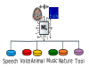
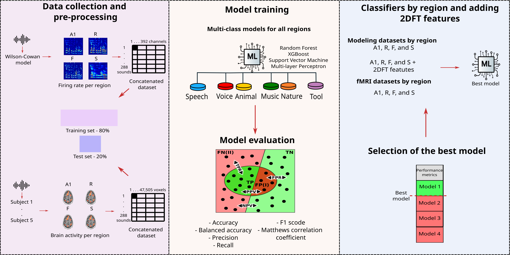
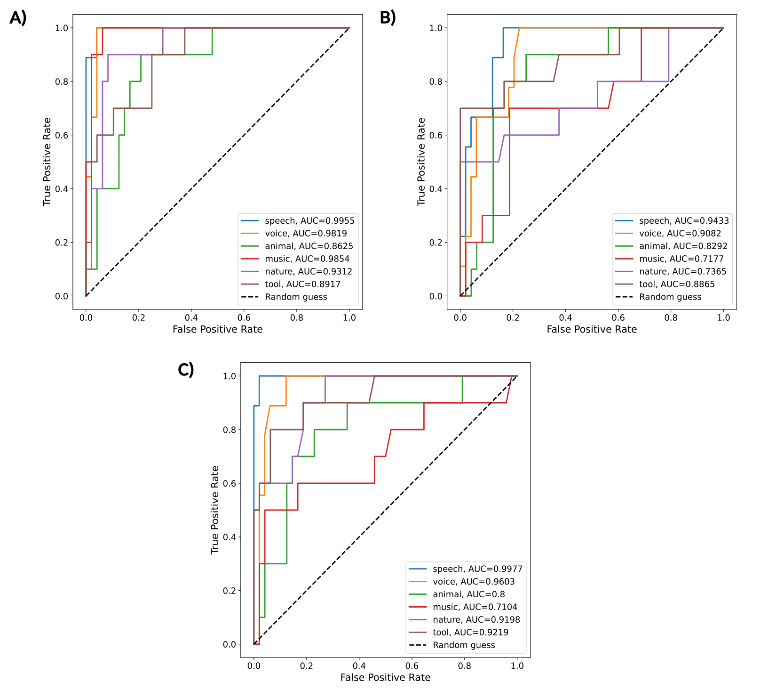
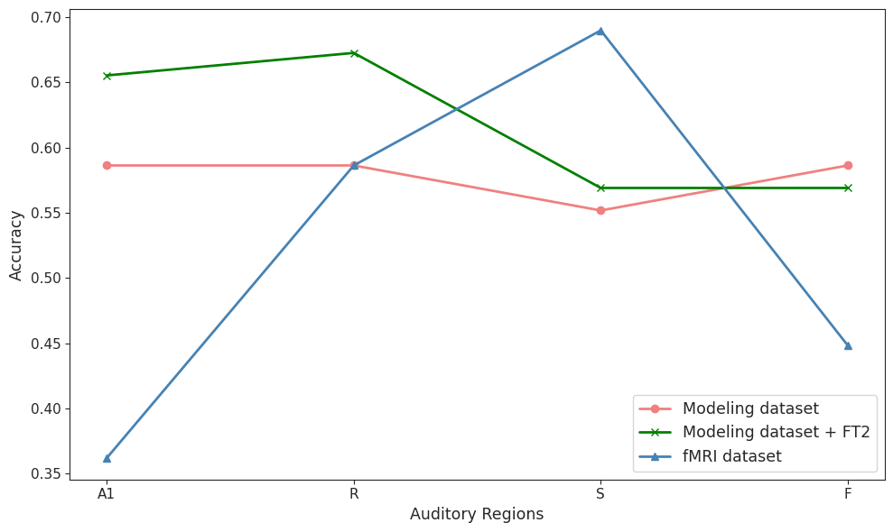

<h1 align="center">
    AuditWC-fMRI-ML
</h1>

  
   

    

   Evaluating the capacity of the Wilson-Cowan firing-rate model to simulate biological sound processing captured by fMRI data using machine learning classifiers.

## Table of contents

- [About the project](#about-the-project)
- [Dataset](#dataset)
- [Methods](#methods)
- [Machine Learning Models](#machine-learning-models)
- [Results of the ML models](#results-of-the-ml-models)
- [Biological Interpretation](#biological-interpretation)
- [Structure of the repository](#structure-of-the-repository)
- [Credits](#credits)
- [Further details](#further-details)
- [Contact](#contact)

## About the project

The human brain processes sound through specialized ventral and dorsal streams within the **auditory cortex**. While computational models like the **Wilson-Cowan (WC) firing-rate model** have been developed to simulate these dynamics, their ability to replicate real physiological responses remains to be fully validated.

In this project, we developed **AuditWC-fMRI-ML**, a classification framework designed to compare the predictive capacity of the **WC model** against **functional magnetic resonance imaging (fMRI)** data. The goal was to determine if the model accurately simulates the biological processing of spectrotemporal modulations in sound. To achive this, we trained **machine learnning (ML) classifiers** on both datasets to **classify 288 sounds across six categories** (speech, voice, animal, music, nature, and tools) and compared their performance across different brain regions.

Our methodology encompasses four main stages:

1.  **Preprocessing:** Concatenation of voxels across subjects and feature extraction for the modeling data.
2.  **Model Selection:** Screening algorithms for multiclass classification.
3.  **Hyperparameter Tuning:** Fine-tuning the best models using [GridSearchCV][gridsearch].
4.  **Evaluation:** Comparing regional performance using various classification metrics.

An overview of the workflow of this project is shown in the graphical abstract below.

  
   
  <em>Figure 1. Graphical abstract of the AuditWC-ML workflow.</em>

The main objectives were to:

1.  **Classify** 288 diverse sounds using neural signatures from both fMRI and simulated firing rates.
2.  **Compare** the performance of model-simulated data against experimental fMRI responses across specific 
brain regions (A1, R, Slow, and Fast).
3.  **Identify** potential refinements for the firing-rate model based on classification discrepancies.

## Dataset

This study uses two distinct datasets containing responses to **288 sounds** across six categories: speech, voice, animal, music, nature, and tools.

* **Experimental (fMRI) Dataset:** Neural responses measured in **47,505 voxels** from five subjects, distributed across **core (A1, R) and belt (Slow, Fast) areas** of the auditory cortex.
* **Modeling (WC) Dataset:** Simulated firing rates in **98 channels for the four regions**. This was supplemented with **2D Fourier Transform (2DFT)** features (80 temporal and 48 spectral) to better capture sound modulations.

| Region | Voxel Count (fMRI) | Channels (WC Model) |
| :--- | :---: | :---: |
| **A1** | 9,511 | 98 |
| **R** | 8,884 | 98 |
| **Slow** | 15,539 | 98 |
| **Fast** | 13,571 | 98 |

## Machine Learning Models

We tested four multiclass classifiers using [scikit-learn][sckit-learn]: **Random Forest (RF)**, **XGBoost**, **Support Vector Machine (SVM)**, and **Multilayer Perceptron (MLP)**. Models were implemented using the **One-vs-All** strategy and evaluated through 3-fold cross-validation. 

The **Random Forest** algorithm was the top performer for both the modeling and fMRI datasets and was selected for in-depth comparative analysis.

## Results of the ML models

The classifiers achieved performance significantly above random chance, demonstrating that both biological and simulated data capture distinguishable sound features. However, the **fMRI-trained models consistently outperformed the basic WC model**.

### Algorithm Comparison (Cross-Validation Accuracy)

| Dataset | RF | SVM | XGBoost | MLP |
| :--- | :---: | :---: | :---: | :---: |
| Modeling | 0.55 | 0.52 | 0.51 | 0.49 |
| fMRI | 0.67 | 0.68 | 0.64 | 0.58 |

### Feature Integration Impact (Random Forest Test Data)

Integrating **2DFT features** into the modeling dataset significantly closed the performance gap with biological fMRI data.

| Metric | fMRI | Modeling | Modeling + 2DFT |
| :--- | :---: | :---: | :---: |
| Accuracy | 0.74 | 0.62 | 0.69 |
| F1-score | 0.73 | 0.63 | 0.69 |
| MCC | 0.69 | 0.55 | 0.63 |

The ROC curves below show that **RF models achieved high classification performance on the fMRI dataset (AUROC>0.85)**, with performance declining on the modeling dataset but substantially **improving when 2DFT features were added**, particularly for speech and voice categories (AUROC>0.95).

 

    
     
    <em><b>Figure 2.</b> ROC curves for all the categories of the multi-class Random Forest algorithms for A) fMRI, B)
modeling, and C) modeling + 2DFT datasets.</em>

 

## Biological Interpretation

* **Regional Specialization:** Biological data (fMRI) showed increased classification accuracy in the **Slow** and **Fast** regions compared to the primary regions (A1, R), supporting the hypothesis that belt areas are specialized for complex sound characterization.
* **Model Limitations:** The WC model exhibited uniform performance across all regions, failing to replicate the regional specialization observed in the human brain. This suggests the need for region-specific parameter tuning.
* **Information Recovery:** The success of the **2DFT features** indicates that current firing-rate models lose critical temporal and spectral modulation data that the biological brain preserves.

As shown in the figure below, the fMRI-trained models demonstrate clear regional hierarchy with highest accuracy in the S region, while the basic WC model shows uniform performance across regions—a gap that narrows considerably when 2DFT features are added.

 

    
     
    <em><b>Figure 3.</b> Accuracy of the classifiers by auditory regions for the fMRI, modeling, and modeling + 2DFT
features datasets. Every line represents one dataset and each point corresponds to one auditory region.</em>

 

## Structure of the repository

| Directory / File | Description |
| :--- | :--- |
| `*.ipynb` | Jupyter notebooks for data preprocessing, model training, and evaluation. |
| [AuditWC-fMRI-ML_manuscript.pdf][manuscript] | Full research report including detailed methods and discussion. |
| `fMRI_dataset_creation/` | Scripts for fMRI data preprocessing and voxel concatenation. |
| `modeling_fairingrate_dataset_creation/` | Tools for extracting Wilson-Cowan firing rates and generating modeling datasets. |
| `Results/` | Classification results and performance metrics across all models and regions. |
| `images/` | Figures for the README and report. |

## Credits

- Developed by [Sebastián Ayala Ruano](https://sayalaruano.github.io/), Alex Rovira, and Daniel Mihaltan. 
This work was developed for the second project period of the [MSc in Systems Biology][sysbio] at [Maastricht University][maasuni].

## Further details

The [PDF Manuscript][manuscript] contains more background information on the Wilson-Cowan model and the fMRI experimental setup, a detailed description of the methodology, and an in-depth discussion of the results.

## Contact

If you have comments or suggestions, please [open an issue][issues] in this repository.

[manuscript]: AuditWC-fMRI-ML_manuscript.pdf
[sysbio]: https://www.maastrichtuniversity.nl/education/master/systems-biology
[maasuni]: https://www.maastrichtuniversity.nl/
[issues]: https://github.com/sayalaruano/AuditWC-fMRI-ML/issues/new
[gridsearch]: https://scikit-learn.org/stable/modules/generated/sklearn.model_selection.GridSearchCV.html
[sckit-learn]: https://scikit-learn.org/